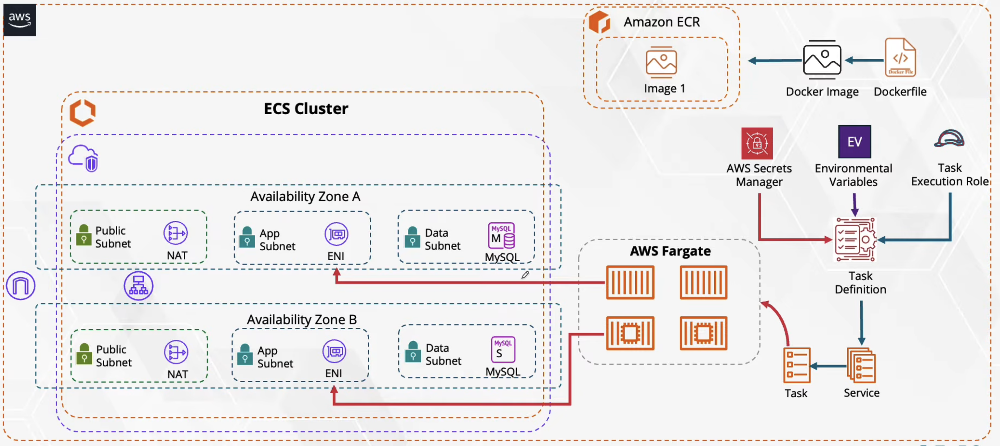

# AWS Infrastructure Provisioning & ECS Deployment via Terraform

This repository demonstrates a production-grade Infrastructure as Code (IaC) approach to provisioning a highly available, containerized environment on AWS using Terraform, paired with automated CI/CD pipelines via GitHub Actions.

## 🏗️ Cloud Architecture

The environment is built upon a standard AWS 3-tier architecture, ensuring strict network isolation, high availability, and scalability across two Availability Zones (AZs).

> **Note on Networking:** The foundational Virtual Private Cloud (VPC) layer—including Public/App/Data Subnets, Internet Gateways, and NAT Gateways—is managed as a separate module in **[VPC-3TIERS](https://github.com/hovietvinh/VPC-3TIERS)** to decouple core networking from application infrastructure.

### ⚙️ Infrastructure Components (Managed via Terraform)

This repository focuses on provisioning the application-specific infrastructure and security layers:

*   **Compute Layer (Amazon ECS & AWS Fargate):** 
    *   Serverless container execution, eliminating EC2 instance management and patching overhead.
    *   Task Definitions configured with specific CPU/Memory allocations.
*   **Database Layer (Amazon RDS for MySQL):**
    *   Fully managed **MySQL 8.0** database deployed securely within isolated, private Data Subnets.
    *   **Automated Secrets Management:** Leverages AWS native integration to automatically generate, encrypt, and manage the master database credentials via **AWS Secrets Manager**, avoiding hardcoded secrets.
    *   **Custom Parameter Configuration:** Implements custom DB parameter groups (enforcing `utf8mb4` character sets) for optimal data handling and robust application compatibility.
*   **Networking & Traffic Routing:**
    *   **Application Load Balancer (ALB):** Placed in the Public Subnets to distribute incoming traffic efficiently across ECS tasks residing in the private App Subnets.
    *   **Security Groups:** Strictly scoped ingress/egress rules. Public-facing SGs only allow HTTPS (443) and HTTP (80) traffic. Internal App and Data SGs are restricted to accept traffic only from the ALB and ECS Tasks, respectively.
*   **Container Registry (Amazon ECR):** 
    *   Private registry provisioned to securely store, manage, and version application Docker images.
*   **Identity & Access Management (IAM):**
    *   **ECS Service Roles:** Strict enforcement of least-privilege principles using dedicated roles for ECS tasks:
        *   **Task Execution Role:** Utilizes the managed `AmazonECSTaskExecutionRolePolicy` for baseline operations (pulling images, CloudWatch logs).
        *   **Task Role:** Uses a custom inline policy scoped explicitly to allow `secretsmanager:GetSecretValue` for injecting database credentials at runtime, preventing broad access to other AWS resources.
    *   **CI/CD Authentication (OIDC):** Integrates an IAM Identity Provider (`token.actions.githubusercontent.com`) exclusively for GitHub Runners. This allows GitHub Actions to assume AWS roles dynamically for deployment, completely eliminating the need for long-lived IAM User credentials (Access Keys/Secret Keys).
*   **Terraform State Management:** 
    *   Remote backend utilizing **Amazon S3** for reliable state storage and **DynamoDB** for state locking to prevent race conditions during concurrent pipeline executions.

---

## 🚀 CI/CD Automation Pipelines

The deployment lifecycle is purposefully decoupled into two independent GitHub Actions workflows to separate infrastructure state from application code delivery. Both pipelines leverage **GitHub OIDC to securely assume AWS IAM Roles (`aws-actions/configure-aws-credentials`)**.

### 1. Infrastructure Provisioning Pipeline (`Provision resources to AWS`)
*   **Purpose:** Manages the complete lifecycle of AWS resources.
*   **State Management:** Dynamically configures the Terraform S3 backend and DynamoDB table based on the target AWS Account ID and environment variables.
*   **Workflow:** Executes `terraform validate`, `plan`, and `apply` to ensure predictable and safe infrastructure updates. 

### 2. Application Deployment Pipeline (`Deploy Application`)
*   **Infrastructure State Integration:** Dynamically pulls current infrastructure metadata (Cluster Name, Service Name, ECR URL, ALB DNS) directly from Terraform state outputs (`terraform output -raw`). This creates a seamless bridge between IaC and App deployments.
*   **Build & Push:** Builds the application Docker image, tags it with the unique Git SHA, and pushes it to the target Amazon ECR repository.
*   **Zero-Downtime Deployment:** Downloads the active ECS Task Definition, updates the container definition with the newly pushed image URI, and registers the new definition to safely roll out the updated application without service interruption.